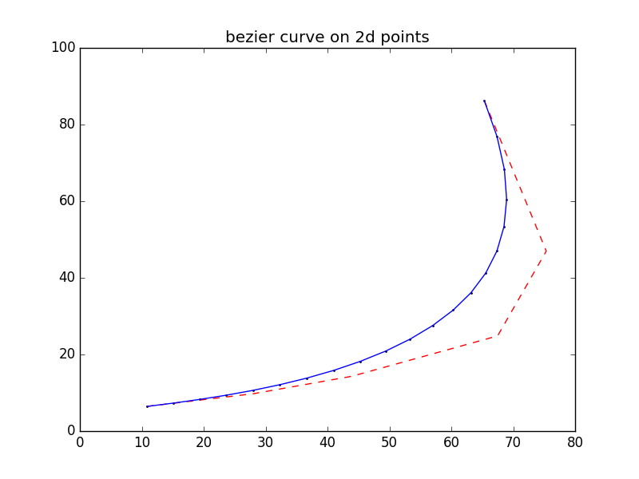
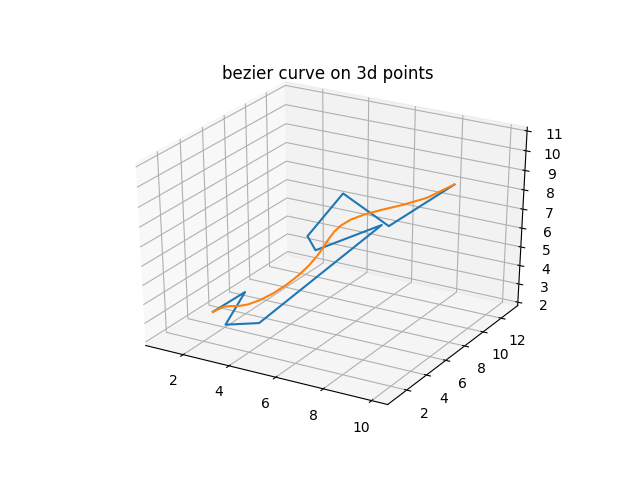

[](https://travis-ci.org/xmba15/bezier_curve/builds)
[](https://opensource.org/licenses/MIT)

# Generic Bezier Curve Library #
- Generic Bezier Curve Library that supports control points of arbitary dimension numbers. (2D and 3D for normal, curvature calculations).
- Class of control point Container is built on top of Eigen Matrix; but can possibly be replaced with user-defined Point Container Class (which is quite a tedious task if starting from 0).

## Dependencies ##
- [Eigen](http://eigen.tuxfamily.org)

## General Usage ##
```cpp
\\ To be added
```

## Examples ##
### 2d points ##

Example for 5-degree bezier curve of the following 2d control points:

```bash
Original control points:
10.83,6.44
27.99,9.75
43.91,14.3
67.48,24.84
75.34,46.97
65.33,86.25
```



### 3d points ##

Example for 9-degree bezier curve of the following 3d control points:

```bash
Original control points:
1,5,2
2,6,3
3,2,3
4,3,3
5,13,5
6,4,7
7,1,9
8,2,11
9,4,9
10,8,10
```



## Acknowledgement ##
- This library is inspired by the following [Bezier library](https://github.com/oysteinmyrmo/bezier), which supports only 2D space (as of 21st June, 2019)
