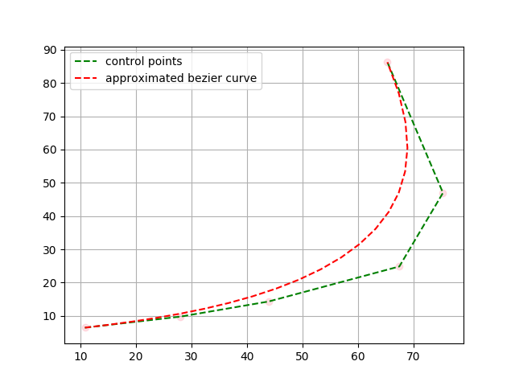
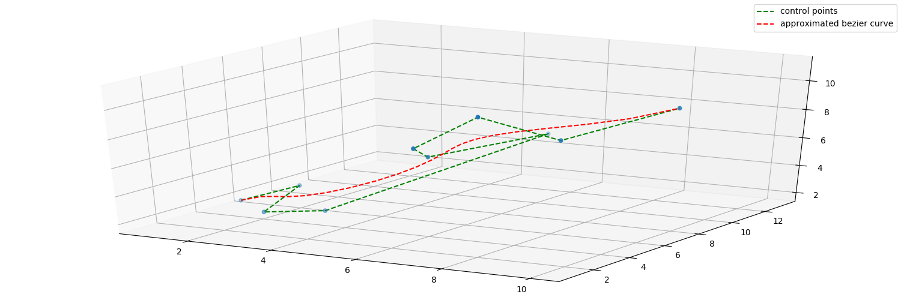
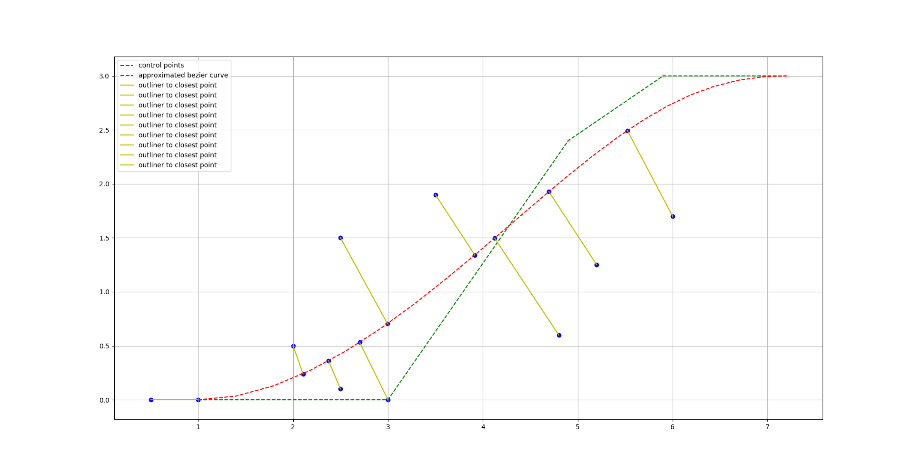
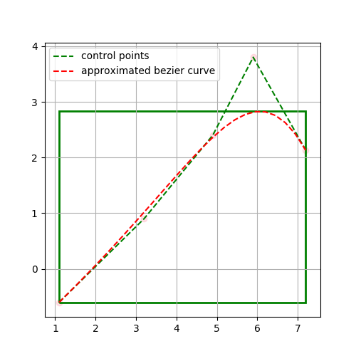

[](https://travis-ci.org/xmba15/bezier_curve/builds)
[](https://opensource.org/licenses/MIT)

# Generic Bezier Curve Library #
- Generic Bezier Curve Library that supports control points of arbitary dimension numbers. (2D and 3D for normal, curvature calculations).
- Class of control point Container is built on top of Eigen Matrix; but can possibly be replaced with user-defined Point Container Class (which is quite a tedious task if starting from 0).

## Dependencies ##
- [Eigen](http://eigen.tuxfamily.org) : **Current build with cmake was tested on Ubuntu 18.04. Build on lower version of Ubuntu OS might require modification of CMake to find Eigen OR manually build latest Eigen from source.**
- [Doxygen](http://www.doxygen.nl/index.html) : Only used for building documentations. The lack of doxygen does not affect the building of this library.

## How to Build ##
```bash
cd /path/to/bezier_curve
mkdir build && cd build
cmake ../ && cmake --build .
```

### Build Options ###
 - WITH_DEBUG=ON/OFF(default: OFF) : whether to enable debug
 - WITH_GTEST=ON/OFF(default: OFF) : whether to enable gtest
 - BUILD_EXAMPLES=ON/OFF(default: OFF) : whether to enable build examples
 - BUILD_DOC=ON/OFF(default: ON) : whether to build doc (by doxygen) or not
 - WITH_VISUALIZATION=ON/OFF(default: OFF) : whether to build examples with visualization (currently used [matplotlib_cpp](https://github.com/xmba15/Another_MatplotlibCpp.git) for visualization)

## General Usage ##
See [Examples](examples)

## Examples ##
### 2d points ##

Example for 5-degree bezier curve of the following 2d control points:

[Source Code](./examples/Ex2DPoints.cpp)

<p align="center">
    
</p>

### 3d points ##

Example for 9-degree bezier curve of the following 3d control points:

[Source Code](./examples/Ex3DPoints.cpp)

<p align="center">
    
</p>

### point projection from an external point to bezier curve ###

In this function, I implemented the algorithm presented in the following paper:

```
Xiao-Diao Chen, Yin Zhou, Zhenyu Shu, Hua Su, Jean-Claude Paul. Improved Algebraic Algorithm
On Point Projection For Bézier Curves. Proceedings of the Second International Multi-Symposiums
on Computer and Computational Sciences (IMSCCS 2007), The University of Iowa, Iowa City, Iowa,
USA, Aug 2007, Iowa, United States. pp.158-163, ff10.1109/IMSCCS.2007.17ff. ffinria-00518379f
```

[Source Code](./examples/ClosestPointsToCurve.cpp)

<p align="center">
    
</p>

### bounding box for bezier curve ###

[Source Code](./examples/ExBoundingBox.cpp)

<p align="center">
    
</p>


## Acknowledgement ##
- This library is inspired by the following [Bezier library](https://github.com/oysteinmyrmo/bezier), which supports only 2D space (as of 21st June, 2019).
- I partly reused the code introduced in ```https://computingandrecording.wordpress.com/2017/03/20/closest-point-to-a-cubic-spline/``` for the functionality of point projection.
